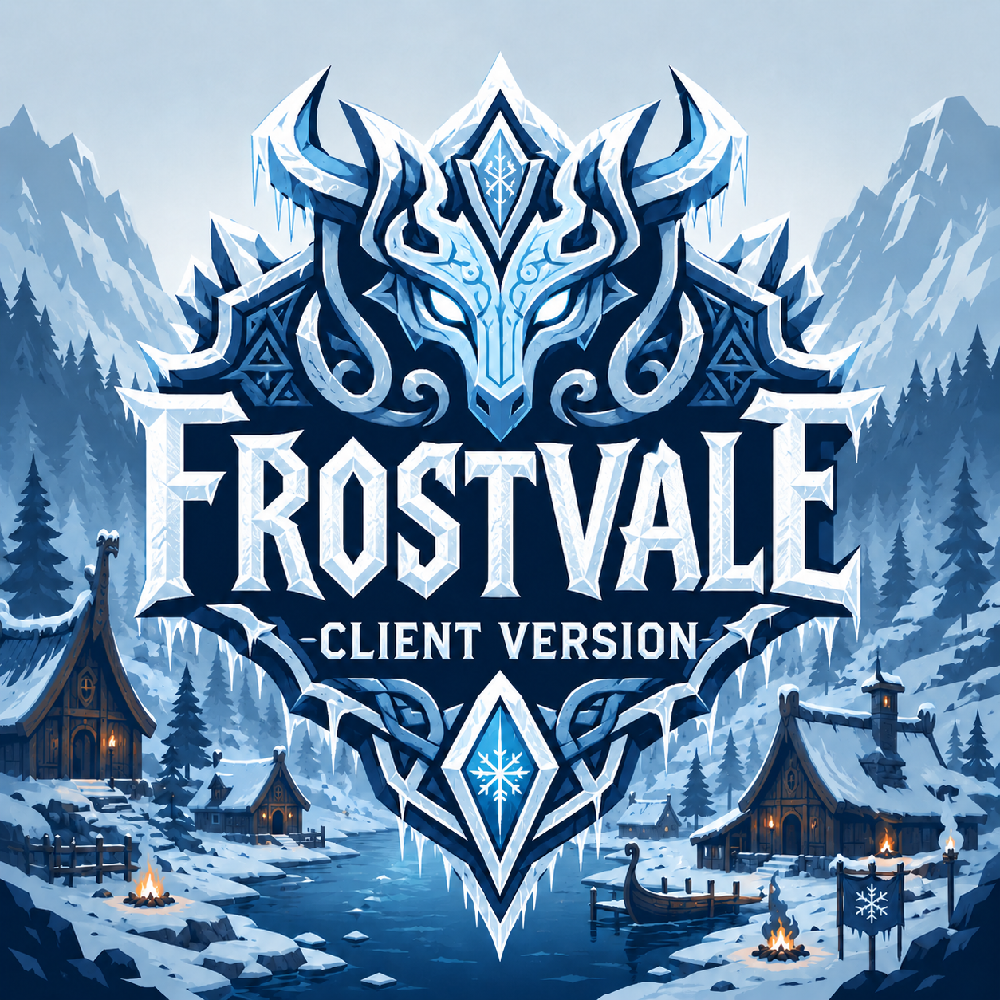

# FrostVale ClientPack 3

FrostVale ClientPack 3 is the player dependency pack for joining the FrostVale
dedicated Valheim server.

FrostVale is a Balrond-first hard-survival pack. The goal is not to throw every
interesting mod into one world and hope it behaves. The goal is to make Valheim
feel larger, colder, more dangerous, and more deliberate while keeping the pack
readable enough to tune when something feels wrong.

## Pack Vibe

FrostVale is built around expedition survival:

- Travel should matter. Portals are disabled, maps stay enabled, and ships,
  carts, routes, supplies, and recovery plans are part of the game.
- Combat should bite. The world is tuned toward harder fights, stronger
  creature pressure, and riskier exploration without turning loot into a slot
  machine.
- Building should be big and useful. Balrond, SearsCatalog, Azumatt, and
  storage/crafting QoL are here so bases can become real workshops and outposts,
  not inventory-management punishments.
- Ocean play should be a feature. Dive In, RtDOcean, TheFisher, Spearfishing,
  Sailing, Balrond Shipyard, and ValheimRAFT are being tested together so water
  travel has danger, utility, and stories.
- The pack is meant to be tuned over time. If a crop, tree, recipe, spawn, loot
  table, or build rule does not make sense, it gets reviewed instead of ignored.

## Core Mod Roles

Balrond is the backbone. Balrond owns the main progression, world content,
building identity, gear, ships, monsters, nature, food/crafting pressure, and a
lot of the pack's personality. FrostVale should feel like a Balrond survival
world first.

Smoothbrain mods add supporting progression through skills like Farming,
Foraging, Sailing, Building, Ranching, Exploration, Darwin Awards, Backpacks,
Jewelcrafting, and now CreatureLevelAndLootControl. CLLC is being used as a
capped hard-mode layer, not as a loot-inflation engine.

Azumatt and MSchmoecker mods carry the quality-of-life layer: craft from nearby
containers, extra inventory space, auto repair, auto-store helpers, build camera,
multi-user chests, and item movement. These are here to reduce friction, not to
remove survival pressure.

The ocean stack is intentionally experimental. RtDOcean adds danger and ocean
content, Dive In changes swimming/diving, TheFisher and Spearfishing keep
fishing active, Smoothbrain Sailing rewards travel, and Balrond Shipyard plus
ValheimRAFT support bigger naval projects.

SearsCatalog, BetterUI, Config Manager, Jotunn, BepInEx, and the networking
helpers make the larger pack usable and easier to diagnose.

## Tuning Philosophy

FrostVale is an ongoing tuning project. The pack should feel hard because the
world is demanding, not because unrelated mods are fighting each other.

Current examples:

- RtDOcean rice is being patched locally so rice belongs near water level. A new
  map is the clean way to test this properly because world generation and older
  placements can hide whether shoreline rules feel right from the start.
- Balrond nature content such as Willow Tree, Willow Seeds, and Willow Bark
  should be reviewed in context instead of accepted blindly. If a plant or tree
  does not fit the biome, recipe, progression stage, or farming loop, it belongs
  on the tuning list.
- CLLC starts capped and reversible: boss-kill scaling, max 3 normal stars,
  modest effects/infusions, and low loot inflation while vanilla, Balrond, and
  RtDOcean creatures are watched.
- Big ecosystem additions are trialed carefully. FrostVale is not adopting a
  second full progression backbone unless the pack identity intentionally
  changes.

## Server Rules

- Portals are disabled on the server.
- Maps are enabled.
- Combat/world difficulty is intentionally high.
- The server owns gameplay and ServerSync-capable mod configs.
- Clients should install this pack; server secrets, Discord operations plugins,
  and server-only config are not distributed here.

## Installation

1. Install Valheim.
2. Install r2modman.
3. Search for `FrostVale_ClientPack_3`.
4. Install version `3.0.6` or newer and launch Valheim through r2modman.

## Related Packages

- Playing solo? Install `FrostVale_ModPack_3`.
- Hosting the multiplayer server? Install `FrostVale_ServerPack_3`.

## Version 3.0.6

- Created the separate player/client package identity.
- Preserves `Balrond-balrond_amazing_nature-1.2.4`.
- Preserves `Soloredis-RtDOcean-2.2.21`.
- Omits server-only Discord operations dependencies now carried by
  `FrostVale_ServerPack_3`.
- Bundles `FrostValeCompat.dll`, the local RtDOcean rice compatibility patch.

## Version 3.0.5

- Added `Smoothbrain-CreatureLevelAndLootControl-4.6.4` as a capped, server-synced hard-mode trial.
- Bundles `FrostValeCompat.dll`, a local compatibility patch that keeps RtDOcean rice planting at shoreline water level.
- Keeps Balrond as the progression backbone; CLLC loot inflation is intentionally low while vanilla, Balrond, and RtDOcean creatures are tested.

## Version 3.0.4

- Replaced `blacks7ar-WieldEquipmentWhileSwimming-1.1.3` with `sighsorry-Dive_In-1.0.5` for Trial A water/naval movement testing.
- Replaced `Marlthon-SeaAnimals-0.3.6` with `Soloredis-RtDOcean-2.2.21` to test Dive In with RtD ocean creature behavior.
- Keeps TheFisher, Spearfishing, Sailing, Balrond Shipyard, and ValheimRAFT in the sea loop.

## Version 3.0.3

- Added `zolantris-ValheimRAFTBETA-4.3.0` for beta vehicle/raft building.
- Added `blacks7ar-WieldEquipmentWhileSwimming-1.1.3` so players can wield equipment while swimming or diving.

## Version 3.0.2

- Removed `Balrond-balrond_amazing_nature_resource`; full `Balrond-balrond_amazing_nature` already provides the active gameplay content, and the resource-only pack was causing duplicate AssetBundle startup errors.
- Includes `ValheimModding-JsonDotNET` so the client pack matches the server-side Discord integration runtime dependency.

## Version 3.0.0

- Rebuilt against the current FrostVale dedicated server profile.
- Updated the dependency list to the pinned packages used by the server.
- Moved config ownership to the server for ServerSync-capable mods.
- Included Discord integration dependencies before the dedicated server package
  split; current client releases omit server-only Discord operations plugins.

## Notes

Mods can break after Valheim updates. Back up worlds and profiles before changing modpack versions.
