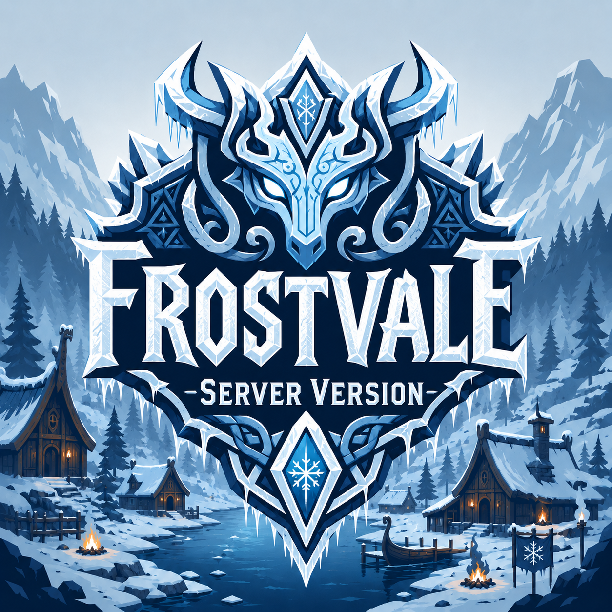

# FrostVale ServerPack 3

FrostVale ServerPack 3 is a dedicated-server modpack for hosts who want a
quality-of-life heavy, conversion-lite Valheim experience. It should still feel
like Valheim: gather, sail, build, explore, die in avoidable ways, and come
back with a better plan. The difference is that the world has more systems,
more reasons to prepare, and more tools to make a long-running server pleasant
to manage.

This pack is built around Balrond. Balrond owns the main progression flavor:
new nature content, building pieces, ships, monsters, gear, food, crafting, and
world identity. FrostVale adds a narrow hint of RtD through RtDOcean to make the
oceans feel more alive without turning the pack into a second full conversion.

Azumatt, MSchmoecker, Smoothbrain, SearsCatalog, BetterUI, and other support
mods round out the experience with better crafting flow, storage, skills, UI,
building ergonomics, and server-friendly tuning. Experimental pieces like
ValheimRAFT and newer networking/performance helpers are included because the
goal is a living hosted world, not just a dependency pile.

## Who This Is For

- Hosts who want a modded Valheim server that keeps Valheim's core feel.
- Groups that like new mechanics and larger systems without a total overhaul.
- Players who want more ocean relevance, better bases, stronger progression
  pressure, and less inventory/crafting friction.
- Server owners who want Discord integration and admin visibility, and are
  willing to do a little setup after installation.

## Pack Identity

FrostVale is Balrond-first hard survival with supporting systems around it.

- Balrond is the backbone for progression, nature, building, ships, monsters,
  gear, food, and crafting flavor.
- RtDOcean is the ocean-life accent. It is here to make sailing and shorelines
  more interesting, not to replace Balrond as the pack identity.
- Azumatt and MSchmoecker mods carry much of the quality-of-life layer:
  craft-from-container, auto-store, workbench tuning, extra inventory space,
  item movement, repairs, and build camera support.
- Smoothbrain mods add skill and progression texture, including sailing,
  farming, foraging, building, ranching, backpacks, jewelcrafting, and a capped
  CreatureLevelAndLootControl hard-mode layer.
- ValheimRAFT is included as an experimental hosted-world feature. Treat it as
  something to test carefully with your group.
- FiresDiscordIntegration, FiresGhettoNetworking, FiresSteamworksPatcher,
  BreakoutNet, and VOIP support server operations, networking, visibility, and
  communication.

## Server And Client Split

Use this package on the dedicated server or host profile.

Players should install `FrostVale_ClientPack_3` instead. The client pack omits
server-only operations pieces such as Discord integration while keeping the
gameplay, UI, VOIP, and networking helpers needed to join and play.

Playing solo? Use `FrostVale_ModPack_3` instead.

## Discord Integration

This server pack includes `FiresDiscordIntegration`, but Discord is not plug and
play. Hosts must provide their own Discord bot token, webhook URLs, channel IDs,
and permissions after installation.

See `docs/DISCORD_SETUP.md` in this package for the setup checklist.

Do not publish or share bot tokens, webhook URLs, server passwords, or generated
live configs.

## FrostVale Tweaks

This package bundles `plugins/FrostValeCompat/FrostValeCompat.dll`, a local
compatibility plugin used to clean up specific world/content behavior as the
pack evolves.

Current tweak:

- RtDOcean rice placement is constrained near shoreline water level so rice
  fits the intended wetland/ocean-adjacent world-gen loop.

As FrostVale is played through, more focused tweaks may be added to smooth out
world generation, biome placement, and content interactions created by the
larger mod stack.

## Host Notes

- This is a server dependency package, not a full Docker/server deployment.
- The pack does not include secrets, live generated configs, world saves, or
  Discord credentials.
- Back up your world before updating mods.
- Test major changes on a separate world before promoting them to a long-lived
  server.
- Expect balancing passes over time. The pack is meant to be tuned while people
  actually play through it.

## Version 1.0.0

- Created the dedicated server package separate from the player/client package.
- Preserves the Balrond-first FrostVale identity.
- Preserves `Balrond-balrond_amazing_nature-1.2.4`.
- Preserves `Soloredis-RtDOcean-2.2.21`.
- Removes `Azumatt-AzuHoverStats`, which is documented by the mod author as
  client-only and not needed on a server.
- Includes Discord/server operations dependencies.
- Includes networking/performance helpers and VOIP.
- Bundles `plugins/FrostValeCompat/FrostValeCompat.dll`.
