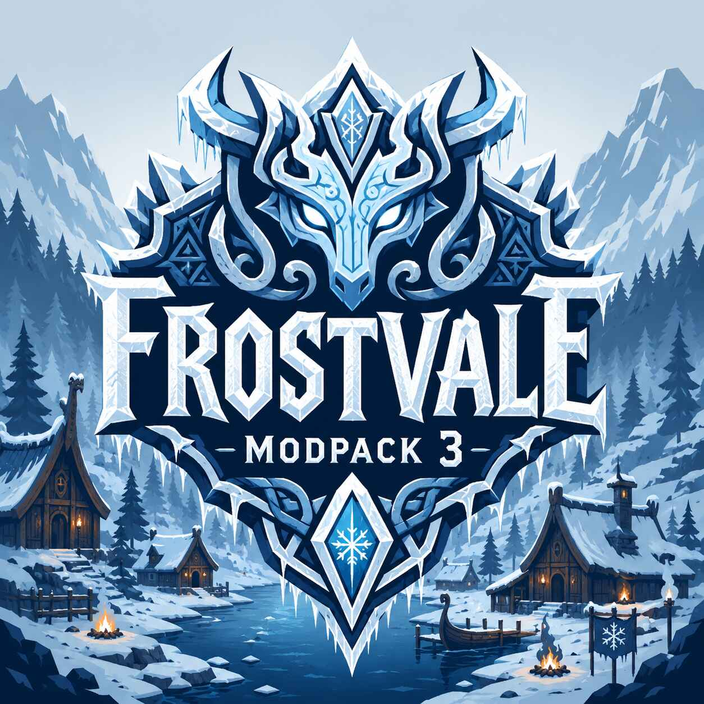

# FrostVale ModPack 3

FrostVale ModPack 3 is the solo/single-player FrostVale package.

It is for players who want a quality-of-life heavy, conversion-lite Valheim
experience that still feels like Valheim. Balrond is the backbone, RtDOcean adds
ocean life, and the QoL stack makes building, crafting, storage, UI, and
progression smoother without turning the game into something unrecognizable.

## Who This Is For

- You are playing solo or single-player.
- You want Balrond-first progression and world flavor.
- You want RtDOcean's ocean and shoreline additions.
- You want QoL, UI, skills, building, storage, and crafting improvements.
- You do not need Discord server operations, VOIP, or multiplayer networking
  helpers.

## Multiplayer Packages

Joining a hosted FrostVale server? Use `FrostVale_ClientPack_3`.

Hosting a FrostVale server? Use `FrostVale_ServerPack_3`.

## FrostVale Tweaks

This package bundles `plugins/FrostValeCompat/FrostValeCompat.dll`, the local
FrostVale compatibility plugin. The first tweak keeps RtDOcean rice placement
near shoreline water level so world/content behavior fits the intended wetland
loop.

## Version 3.0.6

- Created the solo package identity.
- Keeps Balrond, RtDOcean, QoL, UI, Config Manager, BetterUI, AzuHoverStats, and
  `FrostValeCompat.dll`.
- Omits Discord/server operations, VOIP, and multiplayer networking helpers.
